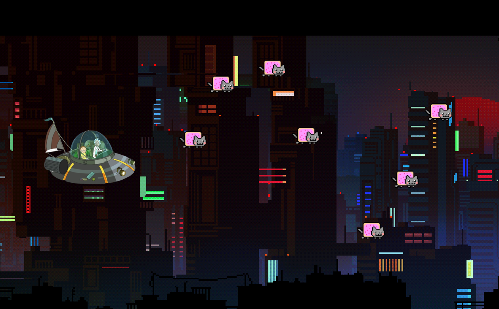

<h1 align="center">Jogo 2D em Java - Programação Orientada a Objetos</h1>

  <strong>Um jogo de plataforma 2D estilo space shooter!</strong>

---

## Descrição

Este jogo foi desenvolvido como projeto na disciplina de Programação Orientada a Objetos utilizando a linguagem Java e a biblioteca gráfica Java 2D.

O objetivo do jogo é controlar uma nave espacial e eliminar todos os inimigos que aparecem na tela. O jogador pode mover a nave para a esquerda e para a direita, além de atirar projéteis para destruir os inimigos. O Jogador pode utilizar seu ataque especial ao pressionar a tecla R.

## Comandos

Movimentar personagem : W A S D ou DIRECIONAIS do teclado;
Atirar : Barra de Espaço;
Ataque Especial : R.

## Recursos Disponíveis

- Gráficos em 2D;
- Nave espacial controlável;
- Ataques de projéteis;
  
## Será Implementado

- Spawn de inimigos variados ;
- Aumento de dificuldade progressiva;
- Sistema de pontuação e vidas;
- Efeitos sonoros.

## Demonstraçao

## Requisitos

- Java Development Kit (JDK) 8 ou superior
- Biblioteca gráfica Java 2D

## Como Executar

1. Certifique-se de ter o JDK instalado em seu sistema.
2. Clone este repositório:

